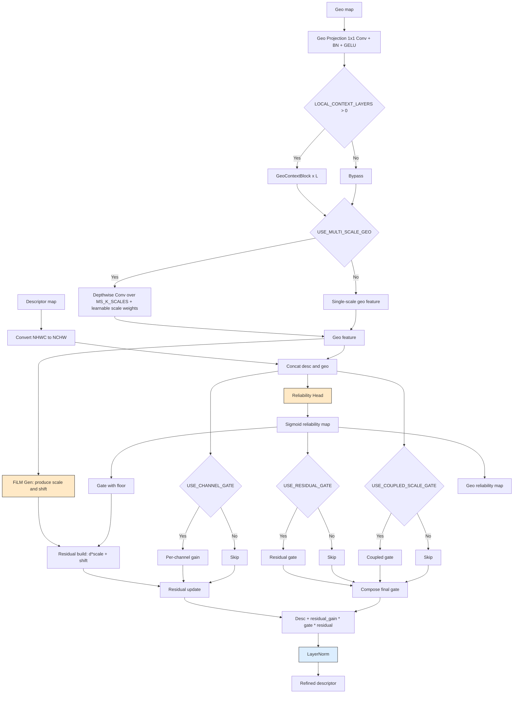

# GeoFeat Correct Framework Diagram

This diagram matches the current implementation in src/model/GeoFeatModel.py.

```mermaid
flowchart LR
    I[Input Image] --> B[Backbone: Standard or RepVGG]
    B --> F[FPN-like Multi-Scale Fusion x3 x4 x5]

    F --> KH[Keypoint Head]
    F --> DH[Descriptor Head]
    F --> GH[Geo Head]

    GH --> GP{Geo Preprocess Mode}
    GP -->|unfold| GU[Unfold 8x8 to channel tokens]
    GP -->|no_unfold_lite| GN[Resize geo map to descriptor resolution]

    DH --> DE[Descriptor Encoder]
    GU --> GE[Per-branch Geo Encoders + Branch Gates]
    GN --> GE
    GE --> ADD1((Add))
    DE --> ADD1

    ADD1 --> RSEL{REFINER_TYPE}

    RSEL -->|GCDR| GCDR[GCDR Pre-Attention Refinement]
    GCDR --> AFT[AttentionalNN with AFT Blocks]

    RSEL -->|None| AFT
    RSEL -->|Local| AFT
    RSEL -->|GCLA| AFT

    AFT --> POST{REFINER_TYPE}
    POST -->|Local| LREF[Local Refiner]
    POST -->|GCLA| GCLA[GCLA Refiner]
    POST -->|None or GCDR| BYP[Bypass]

    LREF --> NORM[L2 Normalize]
    GCLA --> NORM
    BYP --> NORM

    NORM --> DOUT[Descriptor Output 64D]

    NORM --> REP[Repeatability Head]
    REP --> PROJ[1x1 Projection to keypoint dim]
    KH --> MIX[Keypoint Logits Fusion with alpha]
    PROJ --> MIX
    MIX --> KOUT[Refined Keypoint Logits]

    style GCDR fill:#ffe9c6,stroke:#333,stroke-width:1.5px
    style AFT fill:#dceeff,stroke:#333,stroke-width:1.2px
    style GCLA fill:#e8f7e8,stroke:#333,stroke-width:1.2px
    style LREF fill:#e8f7e8,stroke:#333,stroke-width:1.2px
```

## GCDR Internal Expansion

```mermaid
flowchart TD
    D0[Descriptor map] --> D1[Convert NHWC to NCHW]
    G0[Geo map] --> G1[Geo Projection 1x1 Conv + BN + GELU]

    G1 --> C1{LOCAL_CONTEXT_LAYERS > 0}
    C1 -->|Yes| C2[GeoContextBlock x L]
    C1 -->|No| C3[Bypass]

    C2 --> M0
    C3 --> M0

    M0{USE_MULTI_SCALE_GEO}
    M0 -->|Yes| M1[Depthwise Conv over MS_K_SCALES + learnable scale weights]
    M0 -->|No| M2[Single-scale geo feature]

    M1 --> GF[Geo feature]
    M2 --> GF

    D1 --> CAT[Concat desc and geo]
    GF --> CAT

    CAT --> REL[Reliability Head]
    REL --> R[Sigmoid reliability map]

    GF --> FILM[FiLM Gen: produce scale and shift]
    FILM --> MOD[Residual build: d*scale + shift]

    R --> GATE[Gate with floor]
    GATE --> MOD

    CAT --> CG{USE_CHANNEL_GATE}
    CG -->|Yes| CAG[Per-channel gain]
    CG -->|No| CSK[Skip]
    MOD --> MOD2
    CAG --> MOD2[Residual update]
    CSK --> MOD2

    R --> RG{USE_RESIDUAL_GATE}
    RG -->|Yes| RGG[Residual gate]
    RG -->|No| RGS[Skip]

    CAT --> CSG{USE_COUPLED_SCALE_GATE}
    CSG -->|Yes| CSGG[Coupled gate]
    CSG -->|No| CSGS[Skip]

    RGG --> GM[Compose final gate]
    RGS --> GM
    CSGG --> GM
    CSGS --> GM

    MOD2 --> OUT[Desc + residual_gain * gate * residual]
    GM --> OUT
    OUT --> LN[LayerNorm]
    LN --> DOUT2[Refined descriptor]
    R --> ROUT[Geo reliability map]

    style REL fill:#ffe9c6,stroke:#333,stroke-width:1.2px
    style FILM fill:#ffe9c6,stroke:#333,stroke-width:1.2px
    style LN fill:#dceeff,stroke:#333,stroke-width:1.2px
```
